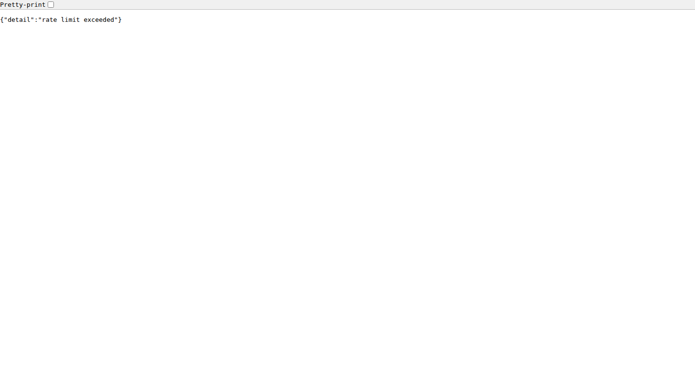
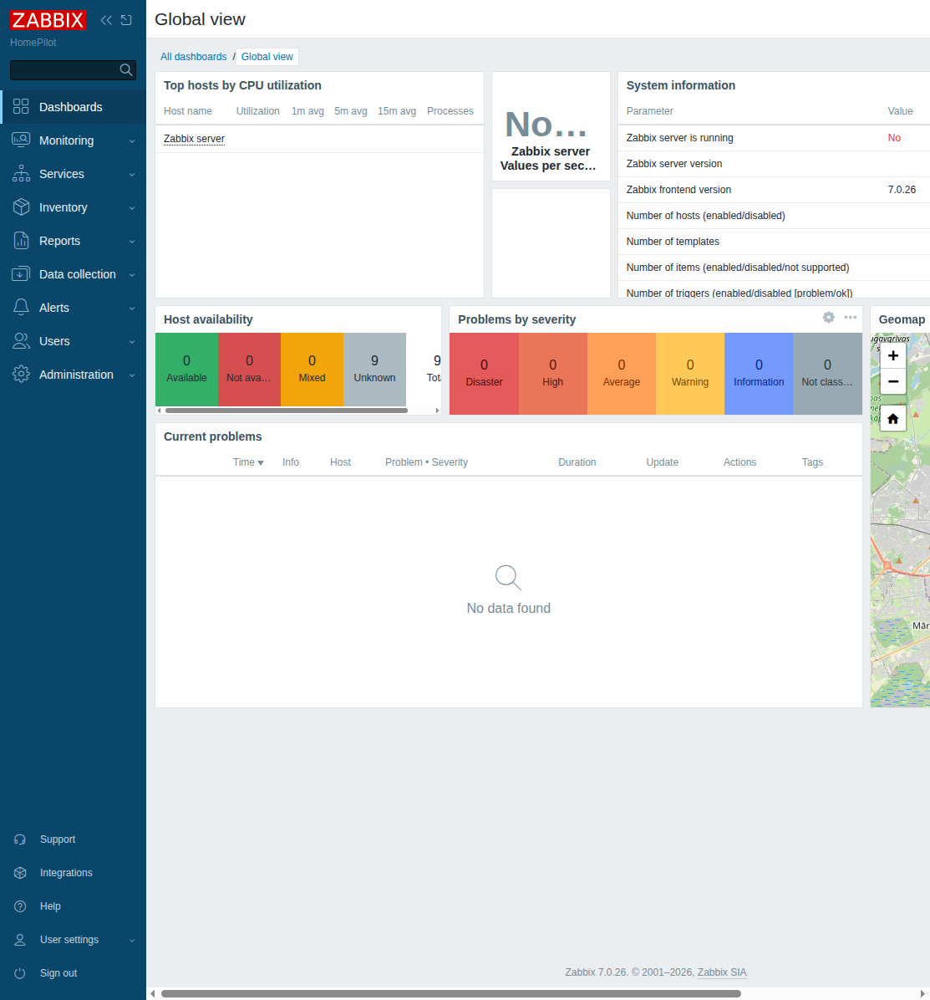
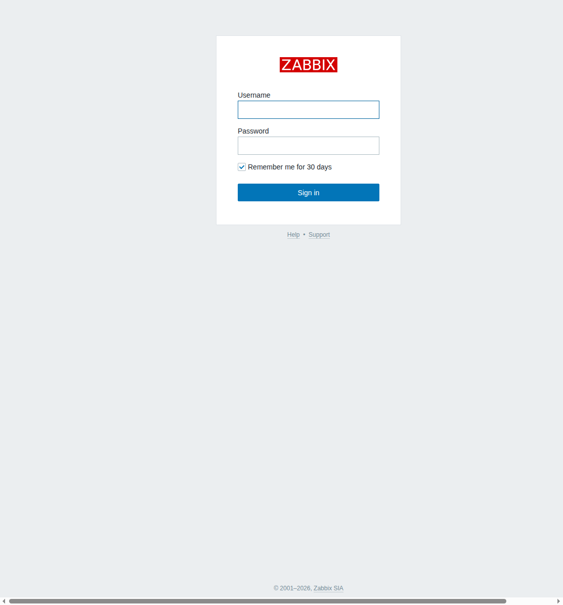

# homepilot-agent

AI orchestration layer for the homelab. Single `docker compose up` brings up the full stack.

HomePilot (IaC engine) runs separately on a Proxmox LXC — this stack connects to it over LAN.

## Stack

| Service | Image | Internal endpoint | Purpose |
|---------|-------|-------------------|---------|
| _LLM_ | external (any OpenAI-compatible API) | `LLM_BASE_URL` | Chat model — ollama / llama.cpp / vLLM / OpenAI. **Not run by this stack.** |
| `n8n` | `n8nio/n8n:latest` | `http://n8n:5678` | Workflow engine, personal agent, webhooks |
| `searxng` | `searxng/searxng:latest` | `http://searxng:8888` | Self-hosted web search |
| `radicale` | `tomsquest/docker-radicale:latest` | `http://radicale:5232` | CalDAV — homelab maintenance calendar |
| `whisper` | `fedirz/faster-whisper-server:latest-cpu` | `http://whisper:8000` | Speech-to-text (profile: `voice`) |
| `piper` | custom (`rhasspy/wyoming-piper`) | `http://piper:5000` | Text-to-speech (profile: `voice`) |

### Internal port conventions

| Port | Service | Note |
|------|---------|------|
| 5678 | `n8n` | Workflow engine |
| 8888 | `searxng` | Search API |
| 5232 | `radicale` | CalDAV |
| 8000 | `whisper` | faster-whisper STT |
| 5000 | `piper` | Piper HTTP TTS |
| 10200 | `piper` | Piper Wyoming protocol |

### Compose profiles (optional services)

- `voice` — `whisper` and `piper`

Default: `docker compose up -d` starts n8n, searxng, radicale.
With voice: `docker compose --profile voice up -d`

The LLM is **not** part of this stack — point the agent at any external
OpenAI-compatible endpoint via `LLM_BASE_URL` / `LLM_MODEL` (see `.env.example`).

## First-time setup

### 1. Install prerequisites

- Docker + Docker Compose
- An OpenAI-compatible LLM endpoint reachable from this host (ollama, llama.cpp,
  vLLM, LocalAI, OpenAI, …). Note its base URL, model name, and API key.

### 2. Create `.env`

```bash
cp .env.example .env
$EDITOR .env   # fill in all placeholder values
```

Required variables: `N8N_ENCRYPTION_KEY`, `SEARXNG_SECRET_KEY`, `TELEGRAM_ALLOWED_USER_ID`.

**`N8N_ENCRYPTION_KEY` is required** — n8n will fail at runtime without it. Generate with `openssl rand -hex 32`.

Secrets (`HP_MCP_TOKEN`, `HP_MCP_TOKEN_RW`, `MATRIX_ACCESS_TOKEN`, `TELEGRAM_BOT_TOKEN`, `RADICALE_PASSWORD`, `HP_WEBHOOK_SECRET`) go in the n8n credential store — see step 6.

See `.env.example` for full documentation.

### 3. Verify the LLM endpoint

This stack runs no model. Point it at any OpenAI-compatible endpoint via
`LLM_BASE_URL`, `LLM_MODEL`, and `LLM_API_KEY` in `.env`. Confirm it answers:
```bash
curl -s "${LLM_BASE_URL}/models" -H "Authorization: Bearer ${LLM_API_KEY}" | jq '.data[].id'
```

For a local ollama backend, `ollama pull "$LLM_MODEL"` first, and bind ollama to
the tailnet/LAN — it has **no auth**, so never expose it publicly.

### 4. Create Radicale htpasswd

```bash
mkdir -p radicale/data
docker run --rm -it tomsquest/docker-radicale htpasswd -Bc /tmp/htpasswd admin
# copy the output line:
docker run --rm -v "$(pwd)/radicale/data:/data" tomsquest/docker-radicale sh -c 'cat /tmp/htpasswd' > radicale/data/htpasswd
```

The `radicale/data/` directory is bind-mounted into the container at `/data`. The htpasswd file must exist at `radicale/data/htpasswd` before starting the service.

### 5. Start the stack

```bash
# Core services (n8n, searxng, radicale):
docker compose up -d

# With voice services:
docker compose --profile voice up -d
```

Persistent data is bind-mounted under `./data/` (n8n, radicale, whisper, piper) —
no named Docker volumes.

### 6. Configure n8n credentials

Open `http://localhost:5678` and create these credentials:

| Credential name | Type | Value |
|-----------------|------|-------|
| `Telegram Bot` | Telegram API | Bot token from BotFather (`TELEGRAM_BOT_TOKEN`) |
| `LLM API` | OpenAI API | Base URL: `LLM_BASE_URL` (e.g. `http://<ollama-host>:11434/v1`), API key: `LLM_API_KEY` |
| `HomePilot MCP Token (read-only)` | HTTP Bearer Auth | `HP_MCP_TOKEN` from `.env` |
| `HomePilot MCP Token (read-write)` | HTTP Bearer Auth | `HP_MCP_TOKEN_RW` from `.env` |
| `Matrix Bot` | HTTP Bearer Auth | `MATRIX_ACCESS_TOKEN` from `.env` |
| `HP Webhook Secret` | HTTP Header Auth | Header: `X-HP-Webhook-Secret`, value: `HP_WEBHOOK_SECRET` from `.env` |
| `Radicale Calendar` | HTTP Basic Auth | User: `RADICALE_USER`, password: `RADICALE_PASSWORD` from `.env` |

### 7. Import workflows

```bash
scripts/import-workflows.sh
```

Imports all workflow JSONs from `n8n/workflows/`. Requires `N8N_API_KEY` in `.env` (create in n8n Settings → API).

### 8. Wire HomePilot webhook

In the HomePilot deployment, set:
```env
HP_EVENTS_WEBHOOK_URL=http://<this-host-lan-ip>:5678/webhook/artifact-proposed
HP_EVENTS_WEBHOOK_SECRET=<same value as HP_WEBHOOK_SECRET in this stack's .env>
```

The n8n Artifact Notification workflow validates the `X-HP-Webhook-Secret` header against the `HP Webhook Secret` credential.

### 9. Activate workflows

In n8n UI, activate each workflow. Start with:
1. **Artifact Notification** (passive — just receives webhooks)
2. **Morning Drift Briefing** (cron — fires at 08:00)
3. **Calendar → HomePilot Trigger** (cron — polls every 5 min)
4. **Chat Assistant (Read-Only)** (Telegram listener)
5. **Personal Assistant** (full agent — activate last, after testing)

## Workflows

| File | Purpose |
|------|---------|
| `n8n/workflows/personal-assistant.json` | Full AI Agent: Telegram → LLM + all tools → reply |
| `n8n/workflows/artifact-notification.json` | Webhook → format → Matrix + optional Telegram |
| `n8n/workflows/chat-assistant.json` | Read-only Telegram bot using HomePilot MCP |
| `n8n/workflows/morning-briefing.json` | Daily 08:00 drift + artifact summary |
| `n8n/workflows/calendar-trigger.json` | Polls Radicale for `hp:propose` events → HomePilot |
| `n8n/workflows/voice-assistant.json` | Voice webhook → Whisper STT → LLM → Piper TTS (profile: `voice`) |

## Architecture

See [`docs/AGENT-TIERS.md`](docs/AGENT-TIERS.md) — agent ownership and responsibilities.

See [`docs/N8N-INTEGRATION.md`](docs/N8N-INTEGRATION.md) — notification flow, token model, env vars.

See [`docs/voice-spike.md`](docs/voice-spike.md) — voice interface spike (Whisper + Piper).

## Production Infrastructure

### Infrastructure Hosts

| Host | Role | zabbix-agent2 | Notes |
|------|------|---------------|-------|
| database-host | PostgreSQL (LXC) | ✅ | Zabbix DB host |
| monitoring-host | Zabbix server (LXC) | ✅ | Zabbix UI + agent |
| proxy-host | nginx reverse proxy (LXC) | ✅ | HTTPS termination |
| app-server | HomePilot v2 + Docker (VM) | ✅ | Ollama socat bridge |
| agent-host | n8n agent stack (VM) | ✅ | |
| PVE nodes ×3 | Proxmox VE | ❌ | API-only monitoring (SSH blocked) |

### Key Service Endpoints

- **HP v2 API**: `https://<proxy_host>/health` or `http://<core_host>:8000/`
- **Zabbix web**: `http://<monitor_host>/zabbix/` or `https://<proxy_host>/zabbix/`
- **Zabbix API**: `http://<monitor_host>/zabbix/api_jsonrpc.php`
- **PVE API**: `https://<pve_host>:8006`
- **Ollama**: `http://<core_host>:11435/api/embeddings` (socat bridge)

### Zabbix Monitoring

Zabbix 7.0 is pre-configured with:
- 5 agent2 hosts (database-host, monitoring-host, proxy-host, app-server, agent-host)
- 3 PVE hosts monitored via API (HTTP agent template)
- Docker plugin on all container hosts
- PostgreSQL monitoring on database-host
- Nginx monitoring on proxy-host

### Ollama Embedding Bridge

The embedding service is accessible via:
- `HP_EMBEDDING_SERVICE_URL=http://host.docker.internal:11435/api/embeddings`
- `HP_EMBEDDING_MODEL=nomic-embed-text`

The bridge uses socat on app-server (port 11435 → localhost:11434) + an SSH reverse tunnel to the cloud Ollama instance.

### Known Limitations

- PVE bare-metal hosts reject SSH — use Proxmox MCP API only
- Ollama SSH tunnel is ephemeral — re-establish after workspace restart
- Zabbix MCP process needs restart after config changes (no hot-reload)
- agent-host VM storage at ~90% (thin provisioning, not critical but monitor)

## Screenshots

### Agent Stack

| n8n Workflows | Radicale Calendar | SearXNG Search |
|---------------|-------------------|----------------|
|  |  |  |

### Zabbix Monitoring

| Dashboard | Host Overview |
|-----------|---------------|
|  |  |

## LLM backend

Inference is external — the agent talks to any OpenAI-compatible endpoint
(`LLM_BASE_URL` + `LLM_MODEL`, configured in the n8n "LLM API" credential).
Run the model wherever you like: a GPU box with ollama / llama.cpp / vLLM, or a
hosted API. To self-host on demand, keep the endpoint on the tailnet and wake it
with Wake-on-LAN when the agent needs it.